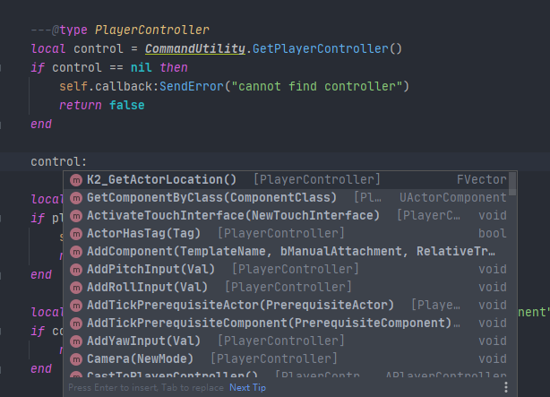
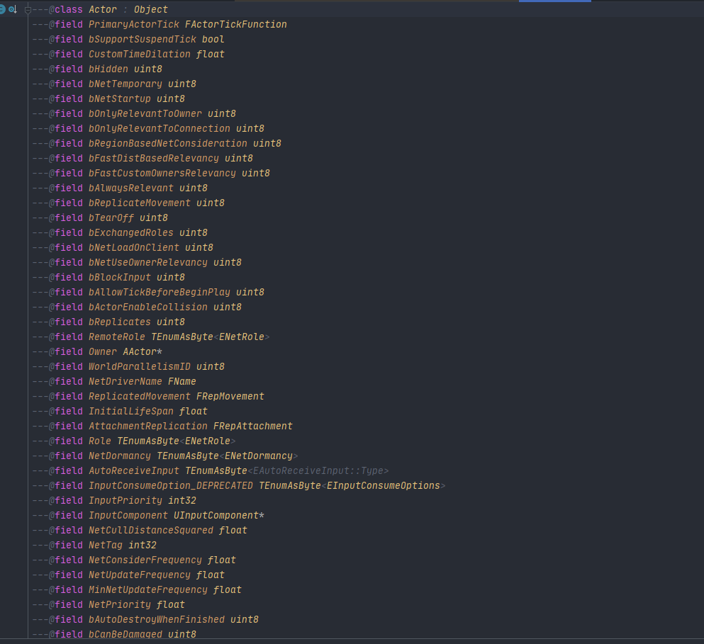

# ue4-emmylua-library-exporter
A Simple Tool To Export Emmy Lua Library From UE4

## 中文说明：

### 文件夹说明
- LibraryExporter：Json转LuaLibrary的C#工具（基于.net core 3.1)
  - EmmyLuaLibraryExporter: 工具源码
  - Build.bat： 重新编译
- Source：UE4导出Json插件

```
// 导出Library到Saved文件夹下，用户需要自己添加到菜单中，或者采用其他的方式调用即可
// 默认路径为Saved/LuaHint.zip，将其加入到EmmyLuaLibrary的列表中，即可使用
FLibraryExporter::ExportLibrary();
```


### 图片示例




